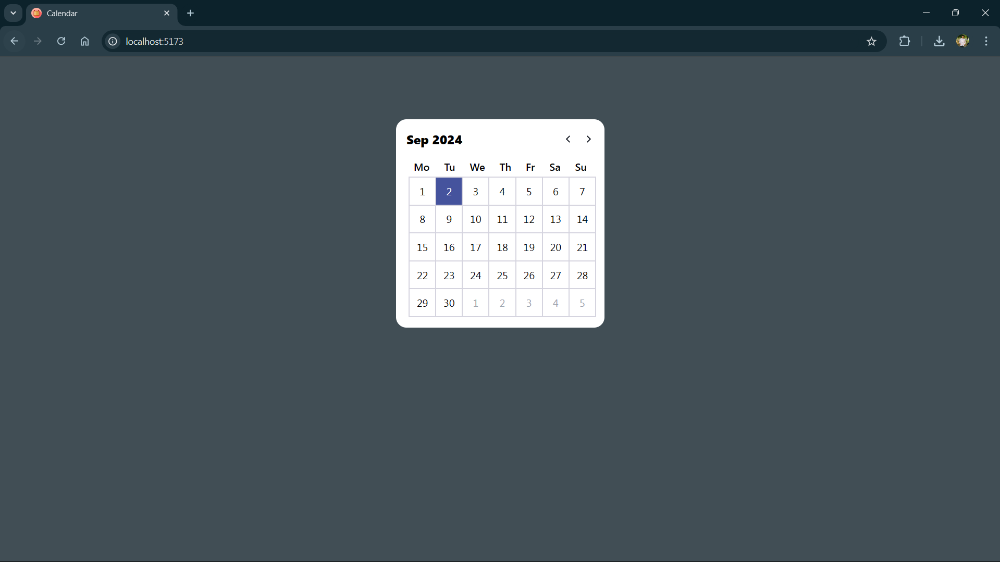

## Calendar App
This project is a simple calendar application built with React and Vite. It allows users to navigate through months and view dates in a grid format. The setup uses Vite for development with support for Fast Refresh through official plugins.

## Features
1. Display of current month and year.
2. Navigation between months with previous and next buttons.
3. Proper handling of calendar dates including previous and next month dates to fill the calendar grid.

### Demo Screenshot

## Created By

This project was created by **Ayush Patel**.